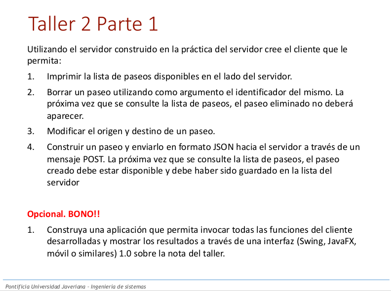
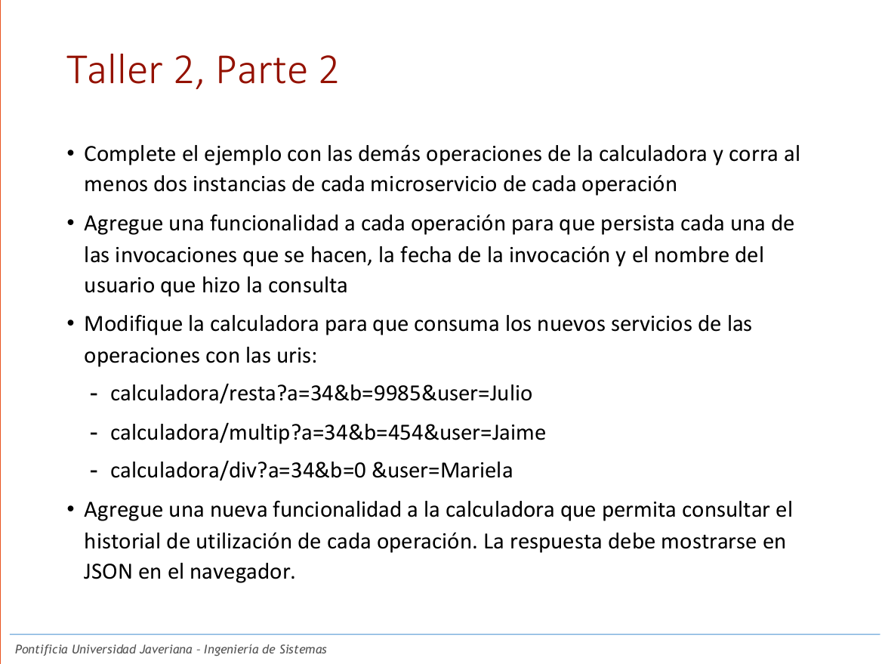

# Taller

## Parte 1

Para esta parte del taller se solicitaba construir un servidor haciendo uso de JAX-RS el cual fuese capaz de:
- Imprimir los paseos disponibles del lado del servidor
- Eliminar paseos identificando los mismos por medio de un ID
- Modificar el origen y el destino de un paseo
- Agregar a la lista de paseos un paseo enviado al servidor en formato JSON mediante un mensaje POST

Y como bono:
- Construir una aplicación que permita invocar las diferentes funciones, asi como visualizar la información retornada

Instrucciones para ejecutar esta parte:
1. Verificar que se encuentre en el directorio referente a la parte 1 (Parte-1)
2. Ejecutar usando podman el archivo compose.yml, ejecutando el comando ´podman-compose up´
3. Dado que el bono esta realizado se puede acceder a http://localhost:1025 y ver allí una interfaz gráfica que permite hacer uso de los diferentes endpoints desarollados en Java, y que acceden a una base de datos PostgreSQL (Es importante esperar a que cargue por completo el servidor JAXRS).

## Parte 2

Para esta parte del taller se solicitaba construir un servidor haciendo uso de Spring Boot Cloud el cual fuese capaz de:
- Funcionar como una calculadora
- Separarse (Posteriormente en pequeños microservicios)

Instrucciones para ejecutar esta parte:
1. Verificar que se encuentre en el directorio referente a la parte 2 (Parte-2)
2. Ejecutar el archivo run.sh (Solo fue probado en Linux), el cual va a levantar diferentes réplicas de cada servicio. En caso de querer ejecutarse en otro sistema operativo, la idea del script es levantar diferentes procesos en background que levanten los diferentes servicios haciendo uso de scripts que se encuentran en los directorios respectivos de cada servicio.
3. Una vez se han levantado los diferentes servicios, se pueden observar los servicios registrados acceiendo a http://localhost:8761/ . Y pueden ejecutarse solicitudes que hagan uso del balanceador a http://localhost:8888/ + alguna de las URIs especificadas abajo :
- calculadora/suma -> Sumar dos numeros
    - Parametros: a -> Numero 1, b -> Numero 2, user -> Usuario que realiza la petición
- calculadora/resta -> Restar dos numeros
    - Parametros: a -> Numero 1, b -> Numero 2, user -> Usuario que realiza la petición
- calculadora/multip -> Multiplicar dos numeros
    - Parametros: a -> Numero 1, b -> Numero 2, user -> Usuario que realiza la petición
- calculadora/div -> Dividir dos numeros
    - Parametros: a -> Numero 1, b -> Numero 2, user -> Usuario que realiza la petición
- logs -> Ver el historial de peticiones al servidor